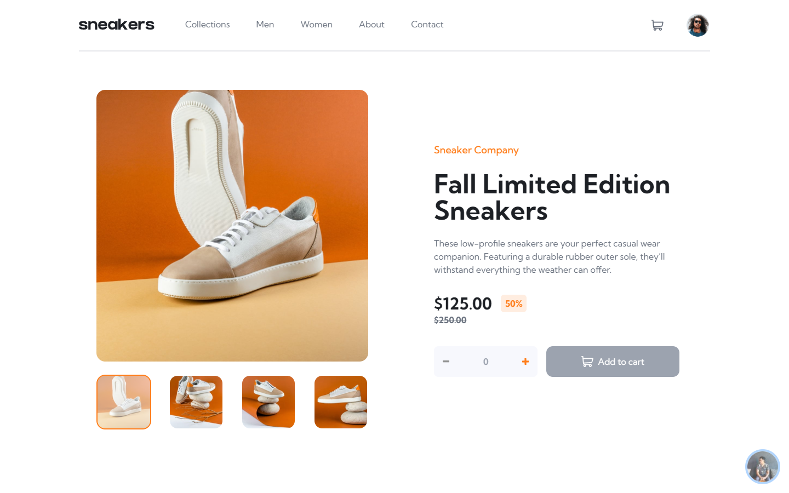
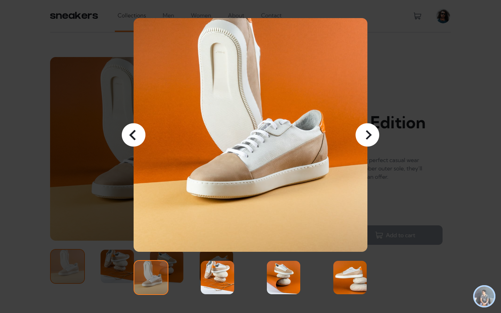
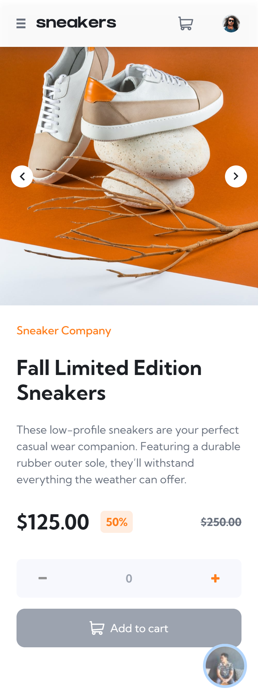

<div id="top"></div>

<div align="center">
  

  <h2 align="center">🎉 Ecommerce Product Page Solution 🎉 <br/><small>build with  Sveltekit &  Tailwindcss </small></h2>
  <p align="center">
    <a href="https://www.frontendmentor.io/challenges/ecommerce-product-page-UPsZ9MJp6"><strong>Frontend Mentor Challenge</strong></a>
    <br />
    <br />
     <a href="https://challenges-sveltekit-ecommerce-product-page.vercel.app/">View Demo</a>
    <strong>·</strong>
    <a href="https://github.com/kodaicoder/CHALLENGES_sveltekit_ecommerce-product-page/issues" target="_blank">Report Bug</a>
      <strong>·</strong>
    <a href="https://github.com/kodaicoder/CHALLENGES_sveltekit_ecommerce-product-page/issues" target="_blank">Request Feature</a>
  </p>
</div>

<!-- Bagdes -->
<div align="center">
  <!-- Profile -->
  <a href="https://www.frontendmentor.io/profile/NutchaponMake">
    
  </a>
  <!-- Status -->
    <a href="#">
    
  </a>
</div>

#

<div align="center">



</div>

## Welcome! 👋

Thanks for checking out this front-end coding challenge.

This is a solution to the [E-commerce product page challenge on Frontend Mentor](https://www.frontendmentor.io/challenges/ecommerce-product-page-UPsZ9MJp6). Frontend Mentor challenges help you improve your coding skills by building realistic projects.

<h2 align="left">Links</h2>

<!-- - Solution URL : [Intro section with dropdown navigation solution (Sveltekit + Tailwind CSS)](https://www.frontendmentor.io/solutions/-intro-section-with-dropdown-navigation-solution-sveltetailwind-tij-O-zXRk) -->

- Live Site URL : [https://challenges-sveltekit-ecommerce-product-page.vercel.app/](https://challenges-sveltekit-ecommerce-product-page.vercel.app/)

<br>

## Table of contents

- [Overview](#overview)
  - [The challenge](#the-challenge)
  - [Screenshot](#screenshot)
- [My process](#my-process)
  - [Built with](#built-with)
- [Author](#author)
- [Acknowledgments](#acknowledgments)

## Overview

### The challenge

Users should be able to:

- View the optimal layout for the site depending on their device's screen size
- See hover states for all interactive elements on the page
- Open a lightbox gallery by clicking on the large product image
- Switch the large product image by clicking on the small thumbnail images
- Add items to the cart
- View the cart and remove items from it

### Screenshot






## My process

### Built with

<!-- Bagdes -->


- [Sveltekit](https://kit.svelte.dev/)
- [Tailwind CSS](https://tailwindcss.com/)
- [Embla Carousel](https://www.embla-carousel.com/)
- CSS Grid
- Semantic HTML5 markup

### Useful resources

- [Svelte](https://svelte.dev/)
- [Sveltekit](https://kit.svelte.dev/)
- [Tailwind CSS](https://tailwindcss.com/)
- [Embla Carousel](https://www.embla-carousel.com/)

## Author

-  Github - [Nutchapon](https://github.com/kodaicoder)
-  Twitter - [@SolanianNut](https://twitter.com/SolanianNut)
-  Frontend Mentor - [@NutchaponMake](https://www.frontendmentor.io/profile/NutchaponMake)

## Acknowledgments

### Run the project

To run the client, you need to run the following command:

```bash
npm install
npm run dev
//or//
npx vite
```
